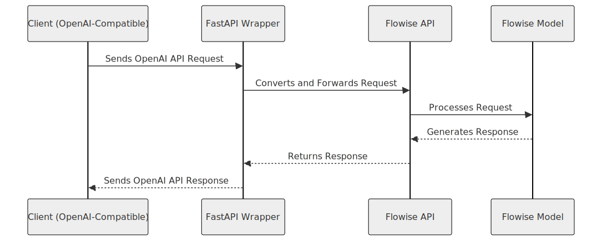

# Flowise OpenAI Wrapper

A FastAPI application that wraps Flowise APIs to be compatible with OpenAI's API standards, enabling seamless integration with OpenAI-compatible clients.


## Features

- **OpenAI-Compatible Endpoints**: Supports `/v1/models` and `/v1/chat/completions`.
- **Flowise Integration**: Translates and forwards requests to Flowise API.
- **Dockerized**: Easily deployable using Docker and Docker Compose.
- **Configurable**: Utilizes environment variables for flexible setup.

## Installation

1. **Clone the Repository**

    ```bash
    git clone https://github.com/anqorithm/flowise-openai-wrapper.git
    cd flowise-openai-wrapper
    ```

2. **Set Up Environment Variables**

    Create a `.env` file in the project root with the following content:

    ```env
    FLOWISE_API_BASE_URL=http://flowise:3000/api/v1
    FLOWISE_CHATFLOW_ID=your_flowise_chatflow_id
    ```

    - **`FLOWISE_API_BASE_URL`**: Base URL for the Flowise API.
    - **`FLOWISE_CHATFLOW_ID`**: ID of your specific Flowise chatflow.

3. **Build and Run with Docker Compose**

    ```bash
    docker-compose up -d --build
    ```

    This command builds the Docker images and starts the services in detached mode.

## Usage

- **List Models**

    ```bash
    curl http://localhost:8080/v1/models
    ```

- **Chat Completion**

    ```bash
    curl --location 'http://localhost:8080/v1/chat/completions' \
    --header 'Content-Type: application/json' \
    --data '{
        "model": "gpt-4o-mini",
        "messages": [
            {
                "role": "user",
                "content": "Say this is a test!"
            }
        ],
        "temperature": 0.7
    }'

## Architecture




## Project Structure

```
project_root/
├── Dockerfile
├── docker-compose.yaml
├── .env.example
├── pyproject.toml
├── poetry.lock
├── README.md
└── src/
    ├── main.py
    ├── config/
    │   ├── config.py
    ├── api/
    │   └── v1/
    │       └── router.py
    ├── models/
    │   ├── openai.py
    │   └── flowise.py
    └── utils/
        └── helpers.py
```

- **`Dockerfile`**: Builds the Docker image for the FastAPI application.
- **`docker-compose.yaml`**: Defines the Docker services for the application and Flowise.
- **`.env.example`**: Template for environment variables.
- **`pyproject.toml` & `poetry.lock`**: Manage project dependencies with Poetry.
- **`README.md`**: Project documentation.
- **`src/`**: Contains the application source code.
  - **`main.py`**: Entry point for the FastAPI application.
  - **`config/config.py`**: Configuration settings using Pydantic.
  - **`api/v1/router.py`**: API endpoint definitions.
  - **`models/`**: Pydantic models for data validation.
    - **`openai.py`**: Models representing OpenAI API data structures.
    - **`flowise.py`**: Models representing Flowise data structures.
  - **`utils/helpers.py`**: Utility functions like date conversions.


## Explanation

1. **Client (OpenAI-Compatible)**: Any application or user making requests in the OpenAI API format.
2. **FastAPI Wrapper**: Your FastAPI application that receives OpenAI-formatted requests.
3. **Flowise API**: The Flowise service's API endpoint that processes the translated requests.
4. **Flowise Model**: The underlying model in Flowise that generates responses.
5. **Flowise API**: Receives the response from the model and sends it back to the FastAPI wrapper.
6. **FastAPI Wrapper**: Translates Flowise responses back into OpenAI API format and returns them to the client.


## License

This project is licensed under the MIT License.